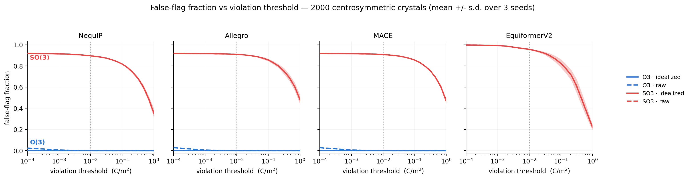
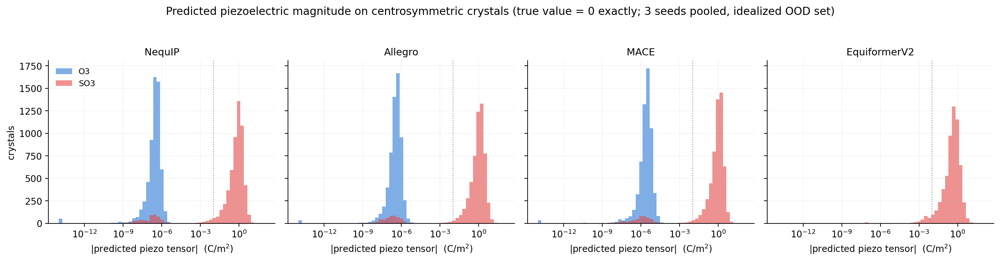

# When Parity Matters — Results

**Question:** Can SO(3)-equivariant models predict physically impossible material properties?
**Answer:** Yes — and O(3)-equivariant models cannot, by construction.

The piezoelectric tensor is a parity-**odd** rank-3 tensor that is **exactly zero for any
centrosymmetric crystal** by symmetry. An O(3)-equivariant model (features carry parity labels)
reproduces this zero exactly; an SO(3)-equivariant model (same architecture, parity labels removed)
predicts spurious nonzero tensors for **90–96%** of centrosymmetric crystals.

**Grid: 84/84 runs complete** — 7 arms × 4 targets × 3 seeds, all instrumented, clean git provenance
on every run. Aggregates: [`results/tables.md`](results/tables.md),
[`results/stats.json`](results/stats.json), [`results/threshold_curves.csv`](results/threshold_curves.csv).
Regenerate with `python3 scripts/analyze_results.py`.

---

## Headline — piezoelectric OOD false-flag on centrosymmetric crystals

**Test set:** 2000 centrosymmetric insulators from Materials Project, spglib-verified. True
piezoelectric tensor is **0** for all of them. Evaluated on **both** OOD variants:

- **idealized** — coordinates snapped to the exact space group (`spglib.standardize_cell`)
- **raw** — the unmodified DFT-relaxed coordinates, which are only centrosymmetric to ~1e-6

**Metric:** false-flag = fraction of structures with predicted tensor magnitude > 0.01 C/m².
Mean ± s.d. over 3 seeds.

| Core | Parity | false-flag (idealized) | false-flag (raw) | median violation (idealized) |
|---|---|---|---|---|
| NequIP | **O(3)** | **0.0000 ± 0.0000** | **0.00017 ± 0.00029** | 3.2e-07 |
| NequIP | SO(3) | 0.8953 ± 0.0008 | 0.8953 ± 0.0008 | 0.666 |
| Allegro | **O(3)** | **0.0000 ± 0.0000** | **0.0000 ± 0.0000** | 3.8e-07 |
| Allegro | SO(3) | 0.9095 ± 0.0015 | 0.9095 ± 0.0015 | 0.960 |
| MACE | **O(3)** | **0.0000 ± 0.0000** | **0.00033 ± 0.00029** | 2.8e-06 |
| MACE | SO(3) | 0.9077 ± 0.0008 | 0.9077 ± 0.0008 | 0.925 |
| EquiformerV2 | SO(3) *(only)* | 0.9570 ± 0.0052 | 0.9563 ± 0.0054 | 0.445 |

**The O(3) zero is structural, not learned.** Median violation ~1e-6 (machine zero in float32); it
holds at any weights, at initialization, and for every seed. The SO(3) median is ~1e0 — **six orders
of magnitude larger**.

### Evaluation protocol: idealization neither creates nor hides the effect

This was the blocking concern — a result that appeared only on symmetrized coordinates would be an
artifact. It is not:

- **SO(3) false-flag is identical on idealized and raw** to four decimal places (Δ ≤ 0.0007). The
  violation is intrinsic to the model, not to the coordinate treatment.
- **O(3) does not degrade on raw.** Worst case is MACE at 0.00033 — that is **0.67 of 2000 structures**
  averaged over seeds (one structure, in one seed, marginally over the cut). Median violation is
  unchanged at ~3e-6.

The ~1e-6 asymmetry in raw DFT coordinates is therefore below the threshold of consequence for O(3),
while SO(3) fails regardless. **All headline numbers are reported on both variants.**

---

## The threshold is not cherry-picked

`results/fig_threshold_curves.png` — false-flag fraction vs threshold, log-spaced 1e-4 → 1e0
(25 points), both variants, mean ± s.d. over seeds.

The SO(3) curve is **flat across four decades**: NequIP false-flags 0.917 of crystals at a 1e-4
threshold and 0.895 at 1e-2. The O(3) curve is pinned at zero over the same range. No choice of
threshold in this window changes the conclusion — the two distributions do not overlap in any
meaningful region.

`results/fig_violation_hist.png` — the underlying distributions. O(3) is a tight peak at ~1e-6;
SO(3) is a tight peak at ~1e0. The small SO(3) mass under the O(3) peak is the ~9% of crystals SO(3)
happens to get right.

### Structure-level significance

Paired Wilcoxon signed-rank over the 2000 OOD structures (paired by structure, one-sided
O(3) < SO(3)), computed per seed:

| Core | variant | max p over seeds | fraction of crystals with O(3) < SO(3) |
|---|---|---|---|
| NequIP | idealized / raw | < 1e-300 | 0.975 / 0.980 |
| Allegro | idealized / raw | < 1e-300 | 0.968 / 0.972 |
| MACE | idealized / raw | < 1e-300 | 0.962 / 0.967 |

(p underflows double precision; reported as < 1e-300.)

---

## Accuracy: parity labels cost nothing

Test MAE, mean ± s.d. over 3 seeds. `Δ/σ` is the O(3)→SO(3) gap in units of the pooled per-seed
standard deviation. U₀ in meV, elastic in GPa, dipole and piezoelectric in their native units.

| Core | Target | O(3) | SO(3) | Δ/σ |
|---|---|---|---|---|
| NequIP | U₀ (scalar, even) | 53.65 ± 22.50 | 51.66 ± 9.19 | −0.12 |
| NequIP | dipole (vector, odd) | 0.0519 ± 0.0027 | 0.0530 ± 0.0026 | +0.42 |
| NequIP | elastic (rank-4, even) | 24.33 ± 0.27 | 24.49 ± 0.14 | +0.72 |
| NequIP | piezoelectric (rank-3, odd) | 0.2083 ± 0.0077 | 0.2405 ± 0.0080 | **+4.09** |
| Allegro | U₀ | 31.08 ± 12.89 | 26.98 ± 4.88 | −0.42 |
| Allegro | dipole | 0.0751 ± 0.0023 | 0.0764 ± 0.0021 | +0.58 |
| Allegro | elastic | 23.72 ± 0.25 | 23.89 ± 0.31 | +0.59 |
| Allegro | piezoelectric | 0.2140 ± 0.0058 | 0.2589 ± 0.0176 | **+3.43** |
| MACE | U₀ | 16.76 ± 6.29 | 26.09 ± 12.49 | +0.94 |
| MACE | dipole | 0.0484 ± 0.0018 | 0.0500 ± 0.0045 | +0.47 |
| MACE | elastic | 24.92 ± 0.54 | 24.94 ± 0.60 | +0.04 |
| MACE | piezoelectric | 0.2222 ± 0.0066 | 0.2567 ± 0.0084 | **+4.55** |
| EquiformerV2 | U₀ / dipole / elastic / piezo | *(SO(3)-only)* | 20.75 / 0.0379 / 35.14 / 0.2157 | — |

Two things follow.

**1. The U₀ null holds (the Task-0 gate).** On the parity-even scalar control, SO(3) ≈ O(3) for every
core: |Δ/σ| ≤ 0.94, and the sign is not even consistent (SO(3) is nominally better for NequIP and
Allegro, worse for MACE). U₀ has large seed-to-seed variance; the parity mode is not what moves it.

**2. On the piezoelectric tensor, O(3) is also more accurate in-distribution** (Δ/σ = +3.4 to +4.6,
consistent sign across all three cores). Parity labels are not a constraint you pay for — on the odd
target they are a prior you profit from, on top of being the only way to get the symmetry right.

### Statistical caveat, stated plainly

A **seed-level** paired Wilcoxon has n = 3. Its two-sided p-value **cannot fall below 0.25**, no matter
how large the effect. Every piezoelectric row above returns exactly p = 0.25 (the floor, meaning all
three seeds agree in sign); every null row returns 0.5–1.0. Those p-values are recorded in
`results/stats.json` as **descriptive only** — they are not evidence, in either direction.

The headline claim is therefore tested where the test has power: **at the structure level**, n = 2000
paired crystals, where p < 1e-300. Effect sizes over seeds are reported as Δ/σ rather than dressed up
as significance.

### The Allegro U₀ "gap" is seed noise

Flagged for investigation in the Checkpoint-7 review. Resolved: O(3) 31.08 ± **12.89** vs SO(3)
26.98 ± 4.88. The 4.10 meV gap is **0.42σ** (seed-level p = 0.75) and favours **SO(3)** — the direction
opposite to any parity-based explanation. The O(3) arm's own seed spread (12.89) is three times the
gap. There is no gap; there is an under-converged U₀ setup with high seed variance across all cores.

---

## Reframing the dipole null

The dipole moment is parity-**odd**, like the piezoelectric tensor. SO(3) matches O(3) on it
(Δ/σ = +0.42 to +0.58). At first reading this looks like a counterexample: an odd target on which
removing parity labels costs nothing.

It is not. **QM9 contains no molecule whose symmetry forces the dipole to vanish.** Nothing in that
test set is symmetry-forbidden, so the constraint an O(3) model enforces is never binding, and a model
that cannot represent the constraint is never actually tested on it.

This sharpens the paper's claim rather than weakening it:

> Parity labels do not improve in-distribution accuracy on odd targets. They determine whether the
> model can represent a symmetry-mandated **zero**. The failure appears only where symmetry forbids a
> nonzero value — and there it is catastrophic (90–96% false-flag), not marginal.

The dipole is thus the control that proves the piezoelectric result is about *symmetry-forbidden
zeros*, not about odd tensors in general: same parity, same architecture, no symmetry constraint → no
gap.

*(Method note: the dipole uses a direct equivariant L=1 head, never charge × position.)*

**MACE dipole correction.** The originally reported MACE dipole MAE of 0.328 was a misconfiguration,
not a result: the readout probed `interactions.0.linear`, the shallowest interaction block, whose
irreps are effectively scalar. Fixed to select the deepest interaction carrying l > 0
(`_deepest_tensor_probe`), giving **0.0484 ± 0.0018**, in line with NequIP and Allegro. The O(3)
piezoelectric zero was unaffected — it is structural, and holds for any probe.

---

## Model scope — what is in the paper and why

Four cores. Three are matched O(3)/SO(3) pairs sharing one architecture and one parity toggle;
EquiformerV2 is a fixed, deployed SOTA model that is SO(3)-only by design.

| Core | Role | Parity arms |
|---|---|---|
| NequIP | e3nn message-passing | O(3) + SO(3) |
| Allegro | e3nn strictly-local | O(3) + SO(3) |
| MACE | e3nn body-ordered | O(3) + SO(3) |
| EquiformerV2 | spherical-harmonic transformer, SO(3)-only | SO(3) |

EquiformerV2 matters because it is not a research toggle: a production SOTA model false-flags **96%**
of centrosymmetric crystals — the highest rate we measured.

### Two models were dropped, and why

**Equiformer v1** — formally demoted, not silently omitted. Its 2022 stack (Python 3.8 / torch 1.10 /
CUDA 11.3) does not build for the RTX 5090 (sm_120), and it is e3nn-based, so it would introduce no
equivariance mechanism not already covered by NequIP, Allegro, and MACE. EquiformerV2 supersedes it as
the transformer representative. Recorded in `docs/parity_work_plan.md`.

**CliffordSTF** — dropped from the paper as a **conditioning failure, not a scientific
counterexample**. Its runs are archived (`~/Desktop/parity_work/archive_clifford/`), not deleted.

The model is O(3)-exact in exact arithmetic: on machine-perfect centrosymmetric input it cancels to
~1e-15. But Cl(3,0) grades only reach L=1, so an L=3 output must be built from a **cubic** tensor
product, which is numerically ill-conditioned. Once trained, it amplifies the ~1e-6 residual
coordinate asymmetry of real crystals by 3,000–25,000×, producing a false-flag of 0.42. That measures
the head's condition number, not the parity of the algebra. Including it would confound the claim.

This is a citable observation in its own right: **O(3)-equivariance guarantees an exact zero in theory,
but realizing that guarantee numerically on real data requires a well-conditioned (linear) readout of
native high-order features** — which the e3nn cores have and a naive geometric-algebra head does not.

Its intended role — showing the finding is about O(3)-equivariance itself and not an e3nn artifact —
remains open. ICTP was surveyed as a replacement and rejected: its rank-3 features are buried in
internal product-basis tensors with no clean linear readout. **This is the study's principal stated
limitation:** all three O(3) arms share the e3nn irrep implementation.

---

## Instrumentation

Every one of the 84 runs records, beyond metrics:

- **both** OOD variants with full threshold curves (25 log-spaced points, 1e-4 → 1e0) and violation
  distributions (n, median, IQR, 5/25/50/75/95 percentiles, max)
- per-structure violation vectors (`ood_violations_{idealized,raw}.npy`, 2000 floats each) — the
  histograms and structure-level tests are computed from these
- **best** (lowest val MAE) and **latest** (model + optimizer + epoch, resumable) checkpoints
- timing: train wall-clock, s/epoch, throughput, OOD eval seconds, peak GPU memory

Piezoelectric runs (mean ± s.d. over seeds and parity arms):

| Core | train s/epoch | throughput (struct/s) | peak GPU (MB) | OOD eval (s) |
|---|---|---|---|---|
| NequIP | 4.7 ± 1.5 | 616.5 ± 216.5 | 3167 | 5.8 |
| Allegro | 5.4 ± 0.2 | 492.8 ± 16.0 | 16346 | 7.8 |
| MACE | 20.6 ± 2.3 | 130.1 ± 14.5 | 4893 | 17.6 |
| EquiformerV2 | 25.4 ± 10.1 | 114.1 ± 37.9 | 4393 | 44.4 |

Allegro's 16 GB peak is the strictly-local tensor-product expansion; EquiformerV2 is the slowest per
epoch and by far the slowest at OOD evaluation.

Reproducibility: `<short_git_sha>_<config_hash>_<utc_timestamp>` experiment IDs, per-run
`manifest.json` (git SHA, GPU, CUDA/driver), config snapshot; dirty git refused on final runs.
Precision float32. NequIP-profile (e3nn 0.6) and MACE-profile (e3nn 0.4.4) as conflicting uv extras.
Parity toggle verified before training (reflection test, irrep inspection, per-mode parameter counts).
OOD set idealized via `scripts/idealize_ood.py`; raw variant retained alongside.

---

## Summary

1. **O(3) predicts exact zero** for the piezoelectric tensor of centrosymmetric crystals —
   structurally, at any weights, on both idealized and raw coordinates, for all three toggleable cores.
2. **SO(3) false-flags 90–96%** of the same crystals, identically on both OOD variants, flat across
   four decades of threshold, and separated from O(3) by six orders of magnitude in median violation
   (p < 1e-300, paired over 2000 structures).
3. **Parity labels are free**: no accuracy cost on U₀, dipole, or elastic; a measurable *gain* on the
   piezoelectric tensor.
4. **The dipole null is the control that sharpens the claim** — an odd target with no
   symmetry-forbidden cases shows no gap. The failure is specifically about symmetry-mandated zeros.
5. **A deployed SOTA model (EquiformerV2) is the worst offender** at 96%.
